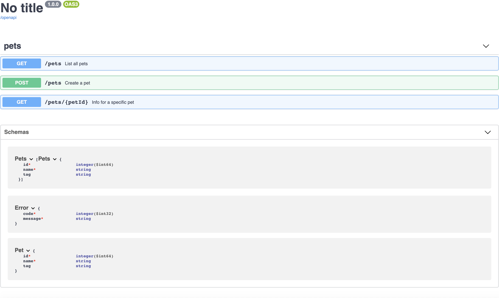

<a href="https://npmjs.org/package/zod-endpoints" title="View this project on NPM"></a>
<a href="./src/__tests__" rel="nofollow"></a>


# Zod-endpoints
Contract first strictly typed endpoints. By defining endpoints as a zod schema, all the requests and responses can be checked and parsed at runtime. Moreover, the TypeScript compiler can check the in- and output types of the endpoints.

In this way the problem space of your application will become much smaller to begin with. By using zod-endpoints you can rely on the types during development and on validation at runtime. This yields reqests and responses you can trust. The focus can shift more to defining business logic instead of input validation and error handling. 

The schema can be used as a contract between consumer and producer. Drivers can be generated from the contract which ensures proper communication between a client and server. 

## Example project

[Example](https://github.com/flock-community/zod-endpoints-example)

## Simplified model

Zod-endpoints is based on a type representation of a http schema.  Below a simplyfied version of the model. The full model can be found [here](src/model.ts). The model is a union of requests which contains a union of response objects. Both request and response contain a union of body types.

````ts
type Body = {
    type: "applictions/json" | "plain/html"
    content: any
}

type Reqest = {
    method: "GET" | "POST" | "PUT" | "DELETE"
    path: [...string[]]
    body: Body | ...Body
}

type Response = {
    status: number
    body: Body | ...Body
}

type Http = Reqest & {
    responses: Response | ...Response
}

type Schema = Http | ...Http
````

## Getting started
First step is to define an endpoint by making use of the [zod-endpoints dsl](src/dsl.ts). Below you can find an example of a simple example. This example contains two endpoints to get and create a project.

### Define endpoints
````ts
import * as z from "zod-endpoints";

const project = z.object({
  id: z.string().uuid(),
  name: z.string(),
})

const schema = z.endpoints([
  z.endpoint({
    name: "GET_PROJECT",
    method: "GET",
    path: [z.literal("projects"), z.string().uuid()],
    responses: [
      z.response({
        status: 200,
        body:{
          type: "application/json",
          content: project
        }       
      }),
    ],
  }),
  z.endpoint({
    name: "CREATE_PROJECT",
    method: "POST",
    path: [z.literal("projects")],
    body:{
      type: "application/json",
      content: project
    },
    responses: [
      z.response({
        status: 201,  
      }),
    ],
  }),
]);
````

## Api
The endpoints can be convert into a service or a client with the [Api](src/api.ts) type. 

### Server
For the  type transforms the schema into an object of the requests. The key of the object is the name of the route the value is a function from the request to a union of the responses. This object is strict typed and exhaustive.

```ts
const service = {
  findProjectById: (id:string):Project => {},
  createProject: (project:Project) => {},
}
````

```ts
import * as z from "zod-endpoints";

const server: z.Api<typeof schema> = {
  "GET_PROJECT": ({path}) => findProjectById(path[1]).then(project => ({ 
    status: 200, 
    body:{
      type: "application/json", 
      content:project
    }
  })),
  "CREATE_PROJECT": ({body}) => createProject(body).Promise.resolve({ 
    status: 201 
  }),
};
```

### Client
The client implementation

```ts
const http = (req: z.ApiRequest) => {
    fetch(req.path.join('/'), {
      method: req.method
    })
}
````

```ts
import * as z from "zod-endpoints";

const client: z.Api<typeof schema> = {
  "GET_PROJECT": (req) => http(req),
  "CREATE_PROJECT": (req) => http(req)
};
```

## Documentation
Zod endpoints is fully compatible with [open api specification](https://www.openapis.org/). The schema can be transformed into open api json. For example with Swagger this can be presented as a documentation website.

```ts
const docs = z.openApi(schema)
````


